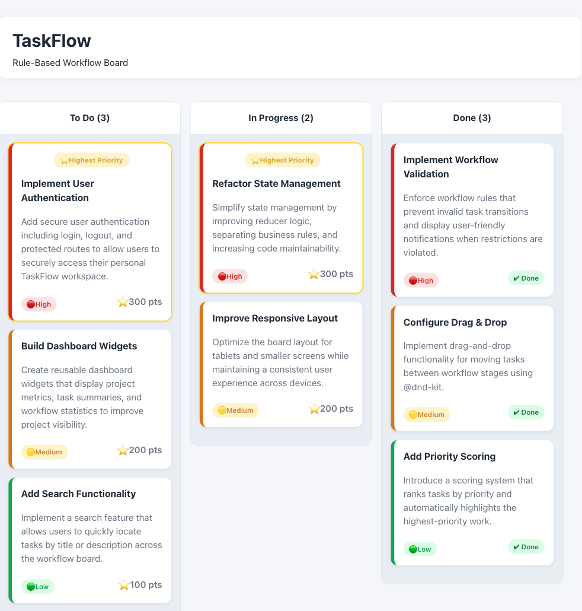
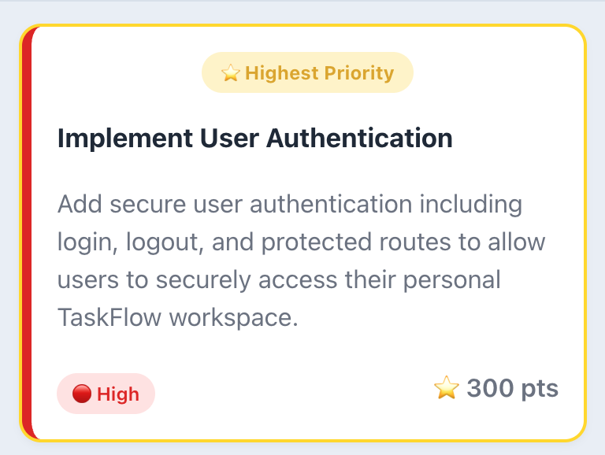
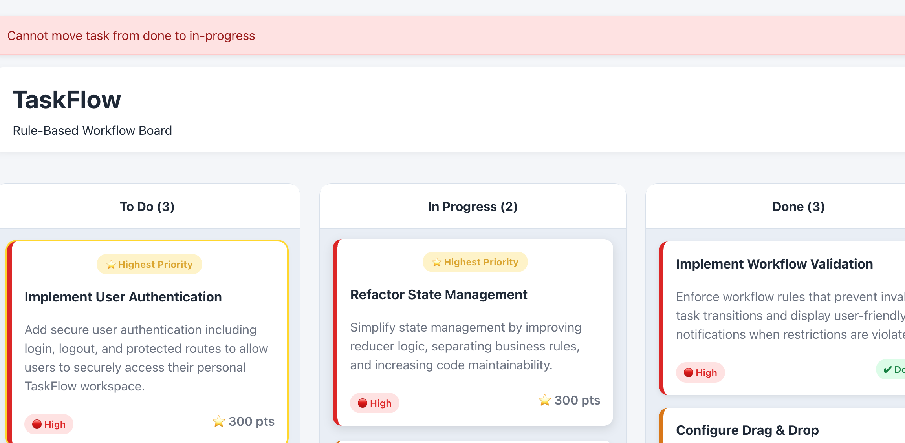

# TaskFlow


TaskFlow is a rule-based Kanban board built with React, TypeScript, and Vite.

Unlike a traditional task board, TaskFlow uses type-safe workflow rules, priority scoring, and workflow validation to create a structured task management experience.

The goal of this project is to demonstrate modern React development practices including component architecture, state management, domain-driven organization, and reusable TypeScript patterns.

---

## Features

- Drag-and-drop task movement
- Rule-based workflow validation
- Priority scoring system
- Automatic task sorting by priority
- Priority-based visual indicators
- Task completion indicators
- Responsive Kanban board layout
- Local storage persistence
- Type-safe domain models
- Error handling for invalid workflow transitions

---

## Screenshots

### Board Overview



### Task Card Design



### Workflow Validation



---

## Tech Stack

| Technology    | Purpose                           |
| ------------- | --------------------------------- |
| React         | User interface components         |
| TypeScript    | Type-safe application development |
| Vite          | Development and build tooling     |
| CSS           | Custom styling and UI design      |
| @dnd-kit      | Drag-and-drop functionality       |
| Local Storage | Client-side persistence           |

---

## Project Architecture

TaskFlow separates UI components, domain logic, and state management to create a maintainable and scalable React application.

```text
src
├── components
│   ├── Board
│   ├── Column
│   └── TaskCard
│
├── domain
│   ├── board
│   └── task
│
├── hooks
│
└── assets
```

Key concepts demonstrated:

- Type-safe domain models
- Separation of business rules from UI components
- Reducer-based state management
- Reusable React component patterns
- Organized project structure

---

## Project Goals

This project focuses on demonstrating:

- Modern React development practices
- TypeScript application architecture
- Business logic separation
- Workflow validation systems
- State management patterns
- Building reusable UI components

---

## What I Learned

Building TaskFlow helped strengthen my experience with:

- Designing TypeScript interfaces and domain models
- Managing application state with reducers
- Creating reusable React components
- Implementing drag-and-drop functionality
- Separating application logic from presentation layers
- Creating maintainable CSS architecture

---

## Future Roadmap

### Version 1.1 - Rich Task Management

- In Review workflow column
- Work Type categories
- Due dates
- Assignees

### Version 1.2 - Task Management

- Add tasks
- Edit tasks
- Delete tasks
- Improved validation

### Version 1.3 - Task Breakdown

- Subtasks
- Progress tracking
- Expand/collapse task details

### Version 1.4 - Productivity Features

- Search
- Filtering
- Sorting options

### Version 2.0 - Advanced Workflow

- Workflow settings
- Analytics dashboard
- Dark mode
- Keyboard shortcuts

---

## Getting Started

Clone the repository:

```bash
git clone https://github.com/garrib10/taskflow.git
```

Install dependencies:

```bash
npm install
```

Start the development server:

```bash
npm run dev
```

Build for production:

```bash
npm run build
```
