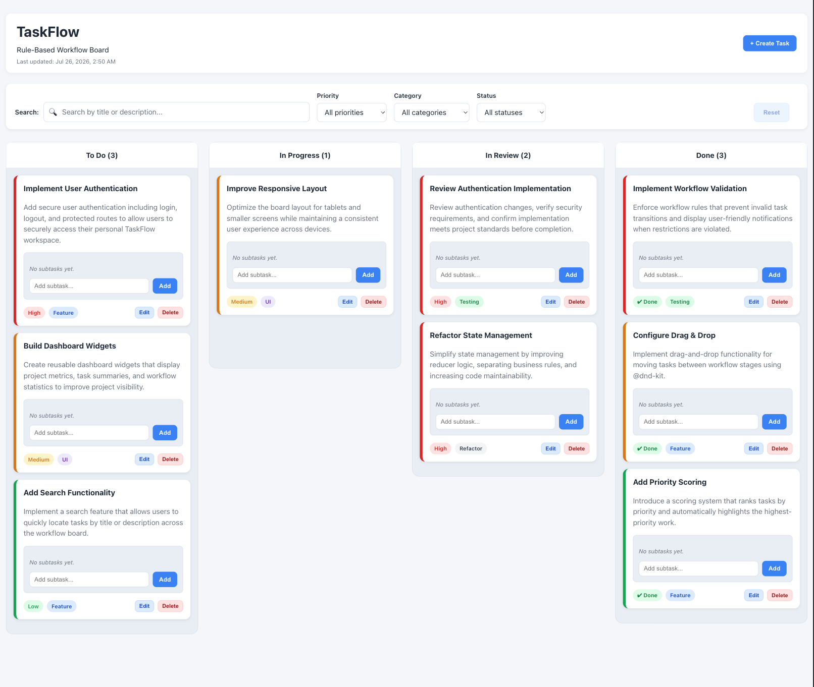
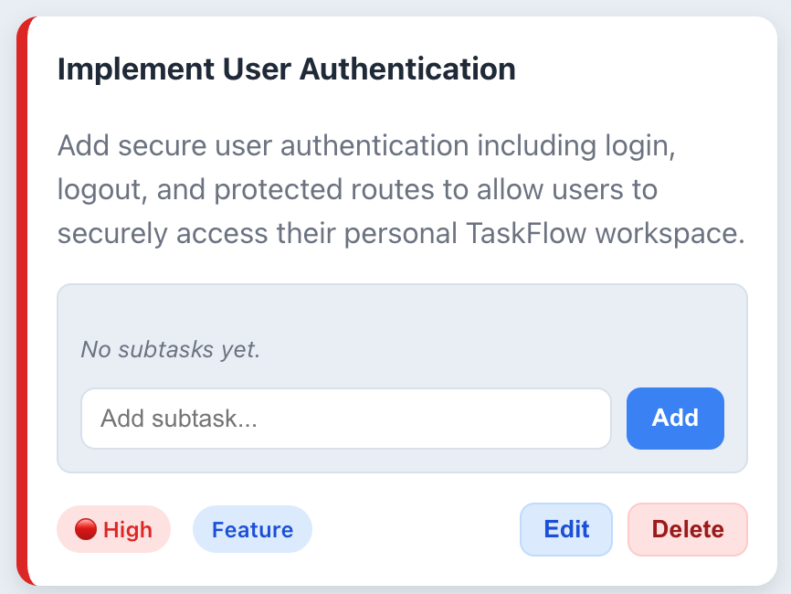
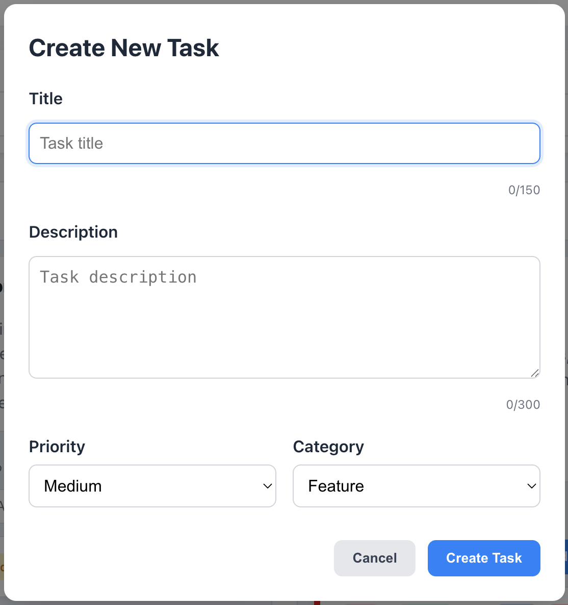
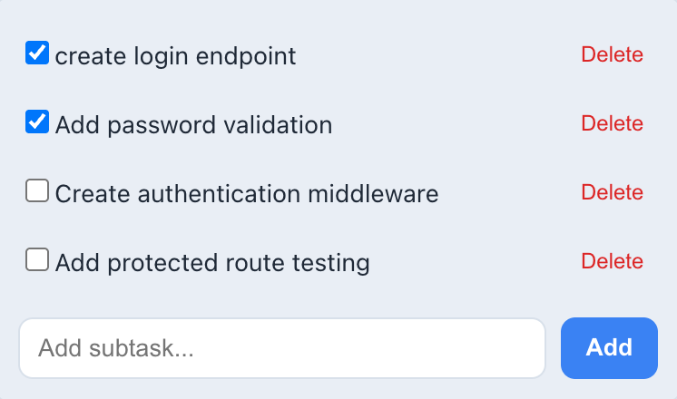
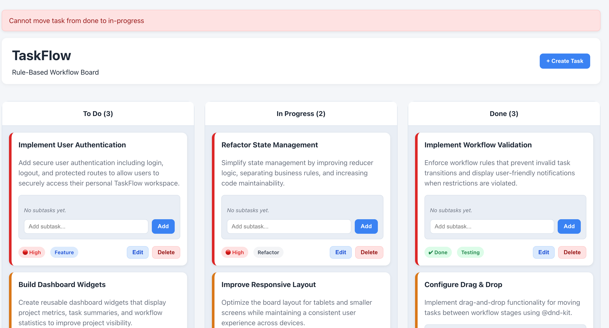
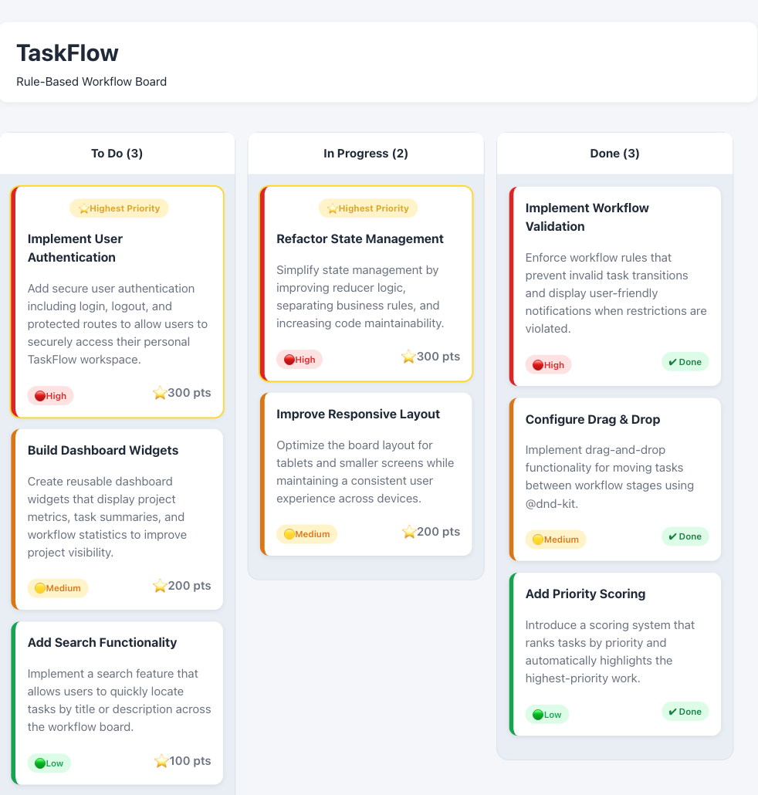

# TaskFlow


TaskFlow is a rule-based Kanban board application built with React, TypeScript, and Vite.

Unlike a traditional task board, TaskFlow uses type-safe workflow rules, priority scoring, workflow validation, and structured task management features to create a more controlled project management experience.

The goal of this project is to demonstrate modern React development practices including component architecture, TypeScript domain modeling, reducer-based state management, reusable components, and separation of business logic from UI presentation.

---

# Features

## Task Management

- Create, edit, and delete tasks
- Priority-based task organization
- Task categories
- Task completion indicators
- Responsive Kanban board layout
- Local storage persistence

## Workflow Management

- Drag-and-drop task movement
- Rule-based workflow validation
- Prevents invalid task transitions
- User-friendly workflow error notifications
- Automatic priority-based task sorting

## Subtask Management

- Create subtasks for larger tasks
- Complete subtasks using checklist functionality
- Delete subtasks
- Persist subtask state using local storage
- Support tasks with zero or multiple subtasks
- Reducer-driven subtask updates
- Independent subtask lifecycle management

## Accessibility

- Keyboard-friendly task management
- Escape key closes task dialogs
- Enter submits forms
- Tab navigation throughout the application
- Visible keyboard focus indicators
- Native accessible form controls

## TypeScript Architecture

- Type-safe domain models
- Strongly typed application state
- Reusable interfaces and components
- Separation between UI and business logic

---

# Screenshots

## Board Overview



## Task Card Design



## Create Task Form



## Subtask Management



## Workflow Validation



# Tech Stack

| Technology    | Purpose                              |
| ------------- | ------------------------------------ |
| React         | User interface components            |
| TypeScript    | Type-safe application development    |
| Vite          | Development and build tooling        |
| CSS           | Custom styling and responsive design |
| @dnd-kit      | Drag-and-drop functionality          |
| Local Storage | Client-side persistence              |

---

# Project Architecture

TaskFlow separates UI components, domain logic, and application state management to create a maintainable and scalable React application.

```text
src
├── App.tsx
├── main.tsx
├── App.css
├── index.css
│
├── components
│   ├── Board
│   │   └── Board.tsx
│   │
│   ├── Column
│   │   └── Column.tsx
│   │
│   ├── TaskCard
│   │   └── TaskCard.tsx
│   │
│   ├── SubtaskItem
│   │   └── SubtaskItem.tsx
│   │
│   ├── SubtaskList
│   │   └── SubtaskList.tsx
│   │
│   ├── TaskForm
│   │   └── TaskForm.tsx
│   │
│   └── Notification
│       └── Notification.tsx
│
├── domain
│   ├── board
│   │   └── Board.ts
│   │
│   └── task
│       ├── Task.ts
│       ├── taskActions.ts
│       ├── taskRules.ts
│       ├── taskPriority.ts
│       ├── priorityStyles.ts
│       ├── categoryStyles.ts
│       └── taskCategory.ts
│
├── hooks
│   └── useBoardReducer.ts
│
├── utils
│   ├── mockData.ts
│   └── storage.ts
│
└── assets
```

---

# Project Goals

This project focuses on demonstrating:

- Modern React development practices
- TypeScript application architecture
- Business logic separation
- Workflow validation systems
- State management patterns
- Building reusable UI components
- Designing maintainable front-end applications

---

# What I Learned

Building TaskFlow helped strengthen my experience with:

- Designing TypeScript interfaces and domain models
- Managing application state with reducers
- Creating reusable React components
- Implementing drag-and-drop functionality
- Separating application logic from presentation layers
- Creating maintainable CSS architecture
- Structuring applications using domain-driven organization
- Building features around business rules instead of only UI behavior

---

# Version History

TaskFlow has evolved through multiple iterations, expanding from a rule-based Kanban board into a structured workflow management application.

## Version 1.0 - Core Kanban System

Completed:

- Kanban board layout
- Task cards
- Workflow columns
- Drag-and-drop functionality
- Basic task movement between workflow states
- Initial component architecture
- Reducer-based state management



---

## Version 1.1 - Task Management Enhancement

Completed:

- Task creation
- Task editing
- Task deletion
- Priority system
- Task categories
- Priority-based task sorting
- Workflow validation rules
- Invalid transition notifications
- Local storage persistence
- Subtask creation
- Subtask completion tracking
- Subtask deletion


---

## Version 1.2 - Workflow & Accessibility Improvements

Completed:

- Added **In Review** workflow stage
- Expanded workflow from **3** to **4** stages
- Updated workflow validation rules
- Improved task badge responsiveness
- Improved task footer layout
- Refined responsive board layout for four columns
- Added keyboard accessibility support
- Escape key closes task dialogs
- Enter submits task forms
- Improved keyboard navigation and focus indicators
- Updated workflow screenshots and documentation


---

# Future Roadmap

## Version 1.2 - Enhanced Task Experience

Planned:

- Search functionality
- Filtering options
- Notification expansion
- Last updated timestamp
- Confirm unsaved changes
- Improved Board Control

## Version 1.5 - Productivity Features

Planned:

- Advanced sorting controls
- Task analytics
- Productivity metrics
- Edit / Audit Log
- Expand/collapse task details
- Create subtasks directly from the task edit modal
- Task history tracking
- Due dates
- Assignees
- Task notes

## Version 2.0 - Advanced Workflow

Planned:

- Custom workflow configuration
- User authentication
- Team collaboration features
- Analytics dashboard
- Dark mode
- Keyboard shortcuts

---

# Getting Started

Clone the repository:

```bash
git clone https://github.com/garrib10/taskflow.git
```

Install dependencies:

```bash
npm install
```

Start the development server:

```bash
npm run dev
```

Build for production:

```bash
npm run build
```
