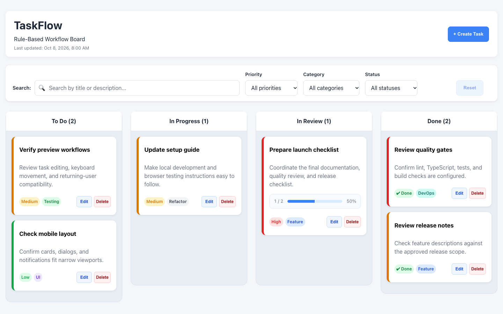
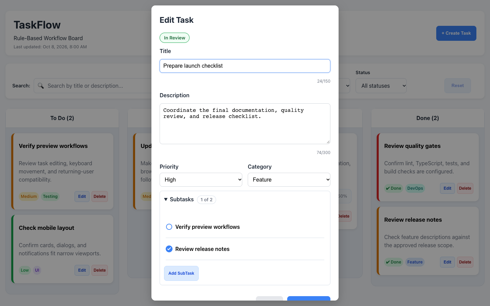
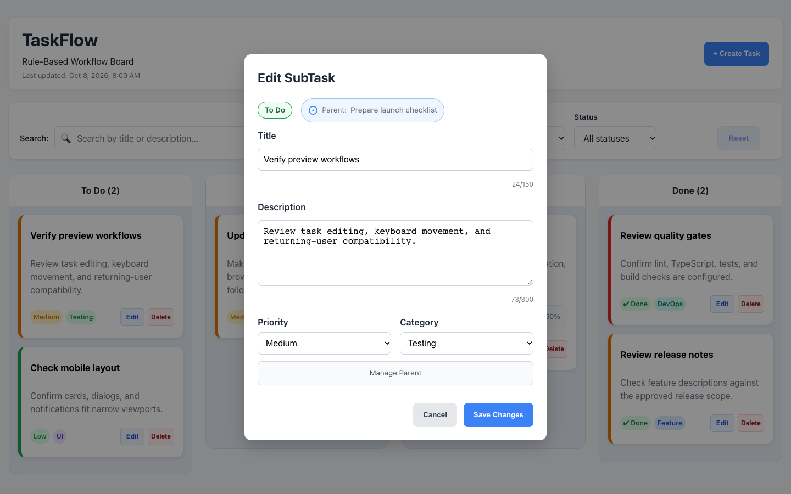

# TaskFlow


TaskFlow is a browser-based workflow board built with React, strict TypeScript,
Vite, and @dnd-kit. It demonstrates domain modeling, deterministic reducer
operations, accessible interaction, and a validated persistence boundary in a
frontend application.

**v1.5.0 release candidate:** package metadata identifies the candidate; production
promotion, the tag, and the GitHub release are still pending. The
[production demo](https://taskflow-garrib10.vercel.app/) follows `main` and may show
the earlier release until promotion. See the [release notes draft](docs/releases/v1.5.0.md)
and [release QA report](docs/v1.5-release-qa.md) for readiness and known findings.

## Features

- Four typed stages: **To Do → In Progress → In Review → Done**. Only the next
  forward stage is allowed; skipping, reversing, and reopening Done are rejected.
- Pointer drag-and-drop, touch hold-and-drag, and keyboard task movement.
- Create, edit, and confirm deletion of tasks; confirmation before discarding
  unsaved form changes.
- Search titles/descriptions; combine priority, category, and status filters and
  reset them together. Cards sort High → Medium → Low with stable equal-priority
  ordering. No user-controlled manual ordering is implemented.
- Linked subtasks with independent workflow stages, parent navigation, creation
  from the parent editor, and completed/total progress on parent cards.
- One-level relationships, completion guards, reassignment/detachment, and parent
  deletion that keeps subtasks as independent tasks.
- Typed success, error, warning, and information feedback. Success expires after
  four seconds and information after six; warnings/errors require dismissal or
  resolution. Persistent storage notices remain while the underlying condition exists.
- Last-updated timestamp, runtime LocalStorage validation, schema version 2,
  repeat-safe legacy migrations, saving-paused recovery, retry for write failures,
  and multiple-tab conflict detection with explicit reload confirmation.
- Dialog labels, associated validation errors, focus containment/restoration,
  task-specific control names, movement announcements, and reduced-motion styles.
- Responsive stacked mobile board and horizontally scrollable tablet board;
  scrolling dialogs keep controls reachable on short screens.
- Unit, component, full-application integration, and Chromium browser smoke tests;
  GitHub Actions quality gates.

Accessibility is tested within the documented scope; **full WCAG compliance is
not claimed**. Known small-text contrast findings remain for release review.

## Current interface

These portfolio-safe screenshots show the v1.5 candidate at a consistent
1440 × 900 viewport. They replace current-feature illustrations that showed the
obsolete checklist editor; historical screenshots below remain historical.







## Run locally

Use **Node.js 24.15 or newer in the Node 24 line** (CI uses Node 24).

```bash
git clone https://github.com/garrib10/taskflow.git
cd taskflow
npm ci
npm run dev
```

Vite prints the local URL. For a production build and local preview:

```bash
npm run build
npm run preview
```

Browser data belongs to the exact origin (scheme, host, and port). Changing the
local port, using another browser/profile, or moving to a Vercel preview does not
transfer a saved board. There is no cloud account or synchronization.

## Testing

```bash
npm test
npm run test:watch
npm run typecheck
npm run lint
npm run build
npx playwright install chromium
npm run test:e2e
```

`npm test` runs Vitest once; `test:watch` stays running during development.
Typecheck validates application, tests, and tooling without building the bundle.
The current suite has **294 tests in 25 files**: 217 unit tests, 63 component/hook
checks, and 14 full-application integration tests. Test counts are candidate
measurements, not a promise of complete coverage.

Playwright runs three journeys at each of 1280 × 720 and 390 × 844: **six smoke
cases** in isolated Chromium storage. It starts Vite dev locally and production
preview in CI at `http://127.0.0.1:4173`, reusing an existing local server outside
CI. Movement uses the supported keyboard interaction. Real touch and spoken
screen-reader checks remain separate. Failure screenshots/traces are ignored;
`npm run test:e2e:report` opens the HTML report.

```bash
PLAYWRIGHT_BASE_URL=https://your-preview.vercel.app npm run test:e2e
```

Protected Vercel previews require owner access; the suite neither stores account
credentials nor bypasses protection. [Integration and CI documentation](docs/v1.5-integration-ci.md)
explains the coverage boundaries.

## Keyboard controls

Tab to a task's movement group. Press **Space** to pick it up, **Left/Right** to
choose a stage, **Space** to drop, or **Escape** to cancel. Ordinary tasks and
subtasks use the same workflow guards. Tab to the task title and activate it to
open the editor; titles turn blue and underline on hover/focus. Dialogs contain
Tab/Shift+Tab focus and restore a meaningful control on closing. See the
[accessibility guide](docs/v1.5-accessibility-keyboard.md) for details.

## Architecture and data

```text
src/
  App.tsx                 Application composition and editor navigation
  components/             Board, cards, forms, dialogs, controls and owned CSS
  domain/board/           Reducer, operation validation, filters, relationships
  domain/task/            Typed task model, workflow, priority and categories
  hooks/                  Board state integration
  persistence/            Runtime validation, migrations and persistence session
  notifications/          Typed notification creation and lifecycle
  accessibility/          Dialog focus and keyboard coordinates
  styles/                 Shared control and dialog styles
  utils/                  Storage boundary and sample board
  test/                   Fixtures and test setup
```

UI validates intended actions and the reducer validates them again against the
current complete board. Action IDs/timestamps are supplied before dispatch.
Filters affect presentation, not relationship integrity. Component CSS is owned
by its component; shared styles remain explicit.

- [Parent/subtask rules](docs/v1.5-parent-child-tasks.md): hierarchy, completion,
  deletion, reassignment, and independently saved subtask edits.
- [Persistence compatibility](docs/v1.5-persistence-reliability.md): storage key,
  schema, v0/v1 conversion, rejected originals, retry, and conflicts.
- [Release-scope inventory](docs/v1.5-release-scope.md): issue/PR/source mappings
  and explicit exclusions.
- [Browser, responsive, and Lighthouse baseline](docs/v1.5-quality-baseline.md):
  October 7–8 measurements and owner VoiceOver review in Google Chrome.
- [Original source audit](docs/v1.5-audit-and-baseline.md): historical findings,
  retained as the pre-engineering record rather than current status.

### Storage limitations

TaskFlow uses the `taskflow-board` LocalStorage key, not a backend. Clearing site
data, private-browsing restrictions, quotas, or a different origin/profile can
make saved work unavailable. Invalid/future-version data is preserved and saving
pauses; it is not silently replaced with sample content. Migration creates no
separate backup. The original remains untouched if decoding/migration fails;
only a valid conversion can replace it.

Multiple tabs do not merge automatically. External changes pause local saving
and require a confirmed reload to discard local work. LocalStorage is not a
transactional database; simultaneous writers can still race. Import/export,
authentication, teams, collaboration, and backend persistence are not implemented.

## Deployment and release workflow

```text
feature branch → develop → staging → main
```

Feature/fix/test/refactor/docs/release branches and `develop` use **Vercel Preview**
deployments. `staging` is the release-candidate branch, also using a normal Preview;
`main` is production. No paid custom pre-production environment is required.
The release-preparation PR targets `develop`; it does not publish v1.5.0.

Frontend CI's **Lint and build** job runs `npm ci`, lint, strict typecheck,
`npm test -- --run`, build, and `npm run test:e2e:ci` after installing Chromium.
**Dependency review** checks PR dependency changes, and CodeQL reviews source.
CI runs for PRs into and pushes to `develop`, `staging`, and `main` as configured.
See [branching and release workflow](docs/branching-workflow.md) for promotion.

Preview, staging, and production origins do not share LocalStorage. Verify the
exact commit preview, review gates, promote through staging, then main, verify
production, and only then publish the tag/release under #91. The legacy `deploy`
script and `gh-pages` dependency are retained historical tooling; **do not use
`npm run deploy` for the Vercel release**. Removing that tooling requires separate
review and is not part of this documentation branch.

## Version history and scope

- **v1.0:** initial columns, cards, reducer, and drag-and-drop.
- **v1.1:** CRUD, priority/categories, LocalStorage, and embedded checklist subtasks.
- **v1.2:** In Review, search/filters, unsaved-change confirmation, last-updated
  timestamp, and interaction refinements. The `v1.2` tag and its release are
  historical, not the current candidate.
- **v1.5.0 candidate:** linked tasks; deterministic strict state handling;
  persistence reliability; accessibility, notifications, responsive improvements;
  component CSS; automated tests and CI. [Draft release notes](docs/releases/v1.5.0.md).

The v1.5 scope preserves the existing design. Capacity/WIP policy, due dates,
import/export, authentication, backend/cloud persistence, collaboration, AI,
analytics/history/assignees/notes, and major visual redesign are outside this
release. v2.0 planning focuses on the approved frontend/domain/persistence and
board experience; it does not automatically commit every excluded feature.
