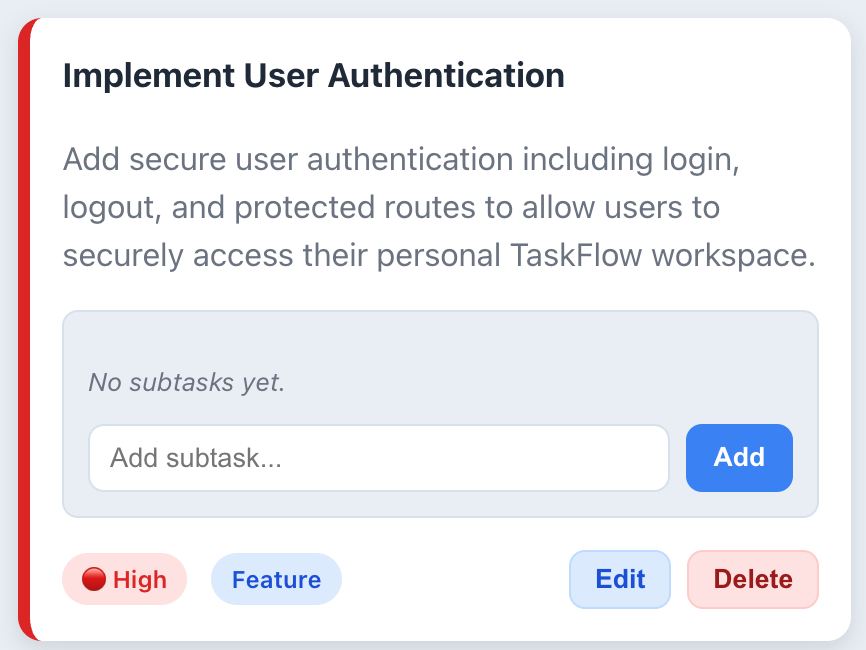
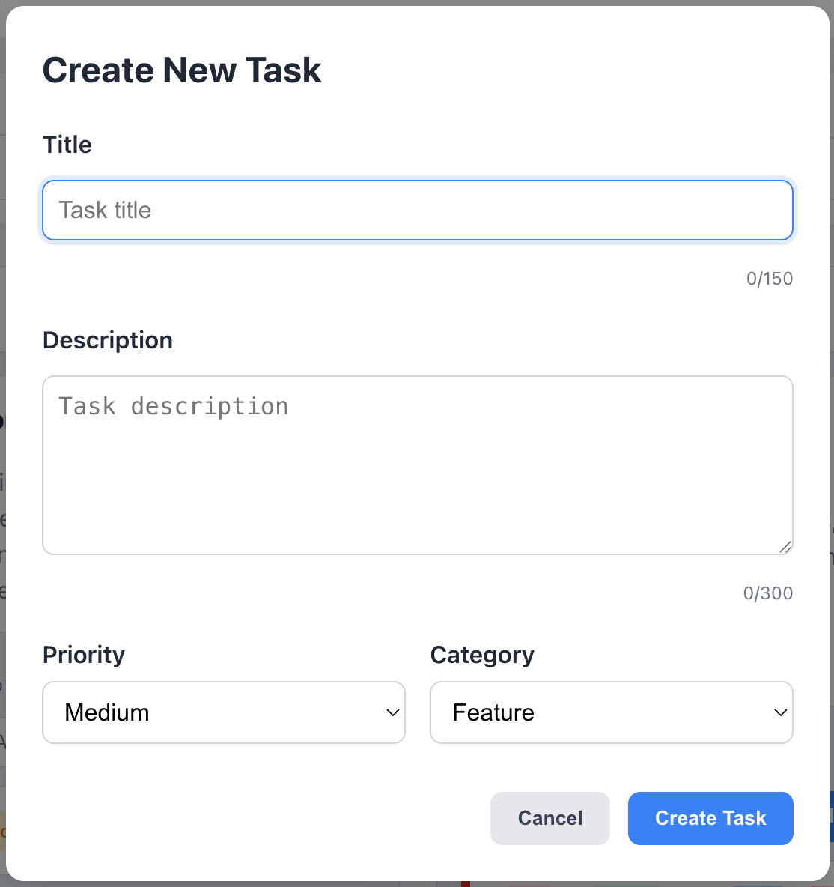
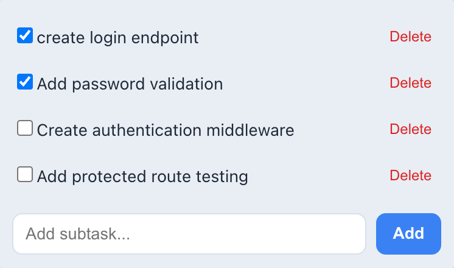
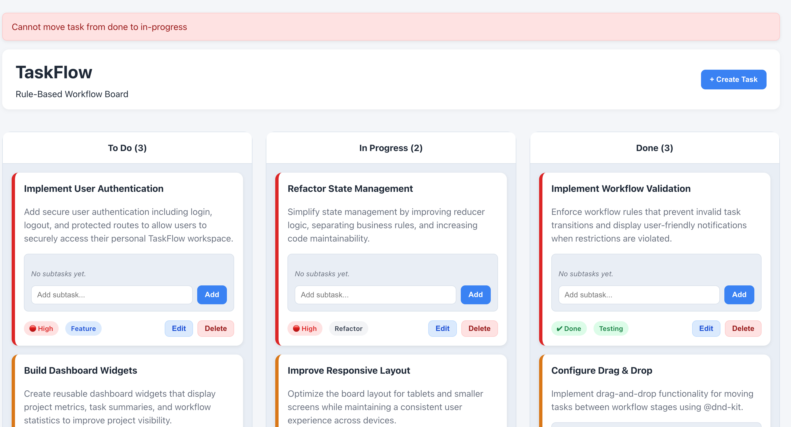
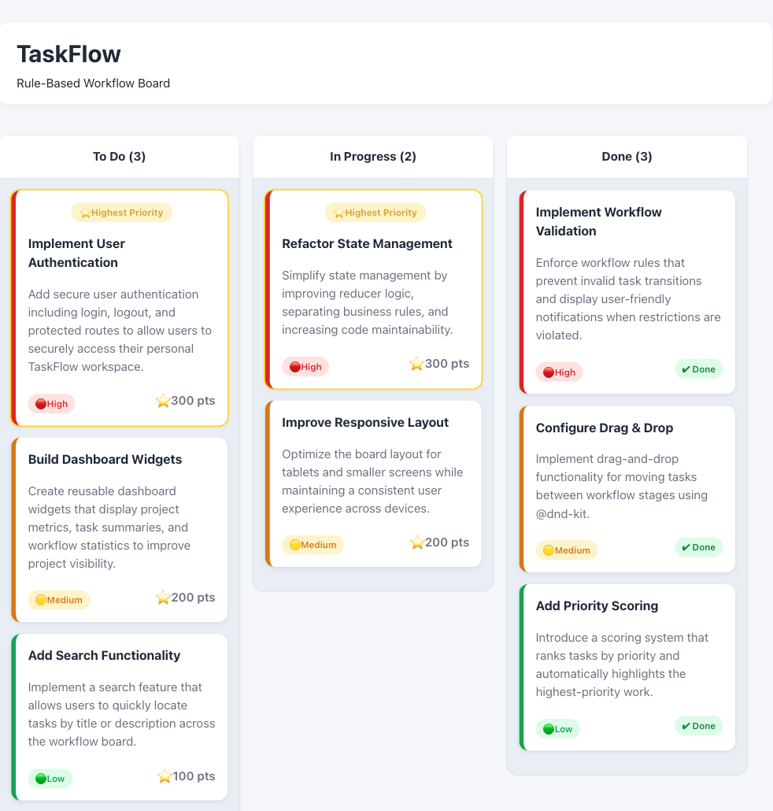
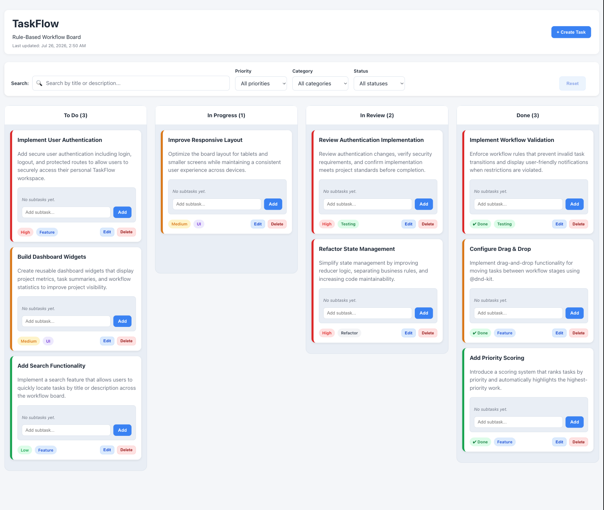

# TaskFlow


TaskFlow is a rule-based Kanban board application built with React, TypeScript, and Vite.

Unlike a traditional task board, TaskFlow combines a four-stage workflow, drag-and-drop task management, workflow validation, priority scoring, search and filtering, subtasks, and structured task organization to create a more controlled project management experience.

The project was designed to demonstrate modern React development practices, including component-based architecture, TypeScript domain modeling, reducer-based state management, reusable UI components, keyboard accessibility, and the separation of business logic from presentation.

---

## Live Demo

🔗 https://taskflow-garrib10.vercel.app/

---

## Key Features

- Four-stage Kanban workflow (To Do → In Progress → In Review → Done)
- Drag-and-drop task management with workflow validation
- Search tasks by title and description
- Filter tasks by Priority, Category, and Status
- Create, edit, and delete tasks
- Subtasks with checklist support
- Linked child tasks with independent workflow stages, parent progress, and relationship management
- Custom confirmation dialogs for destructive actions and unsaved changes
- Success and error notification system
- Last updated timestamp with LocalStorage persistence
- Responsive layout with keyboard accessibility
- Built with React, TypeScript, Vite, and @dnd-kit/core

---

## Screenshots

## Board Overview


## Task Card Design



## Create Task Form



## Subtask Management



## Workflow Validation



## Tech Stack

| Technology   | Purpose                              |
| ------------ | ------------------------------------ |
| React        | User interface components            |
| TypeScript   | Type-safe application development    |
| Vite         | Development and build tooling        |
| CSS          | Custom styling and responsive design |
| @dnd-kit     | Drag-and-drop functionality          |
| localStorage | Client-side persistence              |

---

## Project Architecture

The [v1.5 source audit and quality baseline](docs/v1.5-audit-and-baseline.md) records verified findings, issue mappings, browser measurements, approved scope, and pending manual checks.

The [linked parent and child task guide](docs/v1.5-parent-child-tasks.md) explains relationship rules, board controls, parent deletion, and legacy checklist compatibility pending #66.

The [persistence reliability guide](docs/v1.5-persistence-reliability.md) documents schema versions, checklist migrations, recovery, and multiple-tab conflict behavior.

TaskFlow separates UI components, domain logic, and application state management to create a maintainable and scalable React application.

```text
src
├── App.tsx
├── main.tsx
├── App.css
├── index.css
│
├── assets
│
├── components
│   ├── Board/
│   │   └── Board.tsx
│   ├── Column/
│   │   └── Column.tsx
│   ├── ConfirmModal/
│   │   └── ConfirmModal.tsx
│   ├── FilterControls/
│   │   └── FilterControls.tsx
│   ├── Notification/
│   │   └── Notification.tsx
│   ├── SearchBar/
│   │   └── SearchBar.tsx
│   ├── SubtaskItem/
│   │   └── SubtaskItem.tsx
│   ├── SubtaskList/
│   │   └── SubtaskList.tsx
│   ├── TaskCard/
│   │   └── TaskCard.tsx
│   └── TaskForm/
│       └── TaskForm.tsx
│
├── domain
│   ├── board/
│   │   └── Board.ts
│   └── task/
│       ├── Task.ts
│       ├── taskActions.ts
│       ├── taskCategory.ts
│       ├── taskPriority.ts
│       ├── taskRules.ts
│       ├── priorityStyles.ts
│       └── categoryStyles.ts
│
├── hooks
│   └── useBoardReducer.ts
│
└── utils
    ├── mockData.ts
    └── storage.ts
```

---

### Folder Overview

- **components/** – Reusable React components that make up the application interface.
- **domain/** – Core business models, workflow rules, and task logic.
- **hooks/** – React hooks for reducer-based board state management.
- **utils/** – Mock data generation and LocalStorage persistence.
- **assets/** – Static project assets.

## Project Goals

This project focuses on demonstrating:

- Modern React development practices
- TypeScript application architecture
- Business logic separation
- Workflow validation systems
- State management patterns
- Building reusable UI components
- Designing maintainable front-end applications

---

## What I Learned

Building TaskFlow helped strengthen my experience with:

- Designing TypeScript interfaces and domain models
- Managing application state with React reducers
- Creating reusable React components
- Implementing drag-and-drop interactions with @dnd-kit
- Building reusable confirmation dialogs and notification components
- Designing search and multi-filter functionality
- Implementing keyboard accessibility and focus management
- Separating business logic from UI presentation
- Creating maintainable CSS and responsive layouts
- Structuring applications using domain-driven organization
- Building features around business rules instead of only UI behavior

---

## Version History

TaskFlow has evolved through multiple iterations, expanding from a rule-based Kanban board into a structured workflow management application.

## Version 1.0 - Core Kanban System

Completed:

- Kanban board layout
- Task cards
- Workflow columns
- Drag-and-drop functionality
- Basic task movement between workflow states
- Initial component architecture
- Reducer-based state management



---

## Version 1.1 - Task Management Enhancement

Completed:

- Task creation
- Task editing
- Task deletion
- Priority system
- Task categories
- Priority-based task sorting
- Workflow validation rules
- Invalid transition notifications
- Local storage persistence
- Subtask creation
- Subtask completion tracking
- Subtask deletion


---

## Version 1.2 - Workflow & Accessibility Improvements

Completed:

- Added **In Review** workflow stage
- Added task search and multi-filtering
- Unified search and filtering controls
- Added keyboard accessibility improvements
- Added confirmation for unsaved changes
- Added a persistent last-updated timestamp
- Expanded success and error notifications
- Added reusable custom confirmation dialogs
- Improved Task Form and TaskCard layouts
- Refined responsive behavior and interaction states



---

## Future Roadmap

## Version 1.5 - Productivity Features

Planned:

- Advanced sorting controls
- Task analytics
- Productivity metrics
- Edit / Audit Log
- Expand/collapse task details
- Create subtasks directly from the task edit modal
- Task history tracking
- Due dates
- Assignees
- Task notes
- Add warning notification type (`.notification.warning`)
- Add info notification type (`.notification.info`)
- Add focus trapping and focus restoration for modal dialogs

## Version 2.0 - Advanced Workflow

Planned:

- Custom workflow configuration
- User authentication
- Team collaboration features
- Analytics dashboard
- Dark mode
- Keyboard shortcuts

---

## Getting Started

Clone the repository:

```bash
git clone https://github.com/garrib10/taskflow.git
```

Install dependencies:

```bash
npm install
```

Start the development server:

```bash
npm run dev
```

Build for production:

```bash
npm run build
```

### Testing and validation

Use Node.js 24.15 or newer within the Node 24 release line for the testing tools (CI uses Node 24).

```bash
npm test
npm run test:watch
npm run typecheck
npm run lint
npm run build
```

- `npm test` runs the suite once and exits; use this command in automation.
- `npm run test:watch` reruns affected tests while developing; stop it with Ctrl+C.
- `npm run typecheck` checks application, test, and tooling TypeScript with strict checking enabled, without building the production bundle.
- `npm run lint` checks the existing ESLint rules, including test files.
- `npm run build` validates TypeScript and creates the production application in `dist/`.

Vitest uses `vitest.config.ts`, which reuses the Vite React configuration, runs `src/**/*.test.ts` and `src/**/*.test.tsx` in jsdom, and loads `src/test/setup.ts` for jest-dom matchers and cleanup. Import test APIs explicitly from `vitest`; no test globals, shared render wrapper, application mocks, or browser polyfills are configured. Components currently need no shared providers, so tests render them directly with React Testing Library.

Tests cover workflow transitions and status guards, priority scoring and stable ordering, search and filtering, atomic and deterministic reducer operations, stale editing, and notification rendering/dismissal. See the [state safety contracts](docs/v1.5-state-safety.md) for action ownership and deferred persistence compatibility work. Comprehensive persistence, form, accessibility, and integration coverage belongs to the remaining v1.5 issues.
