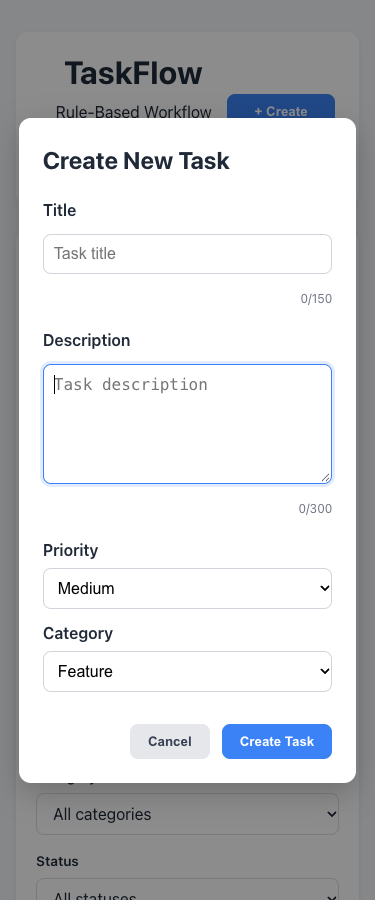
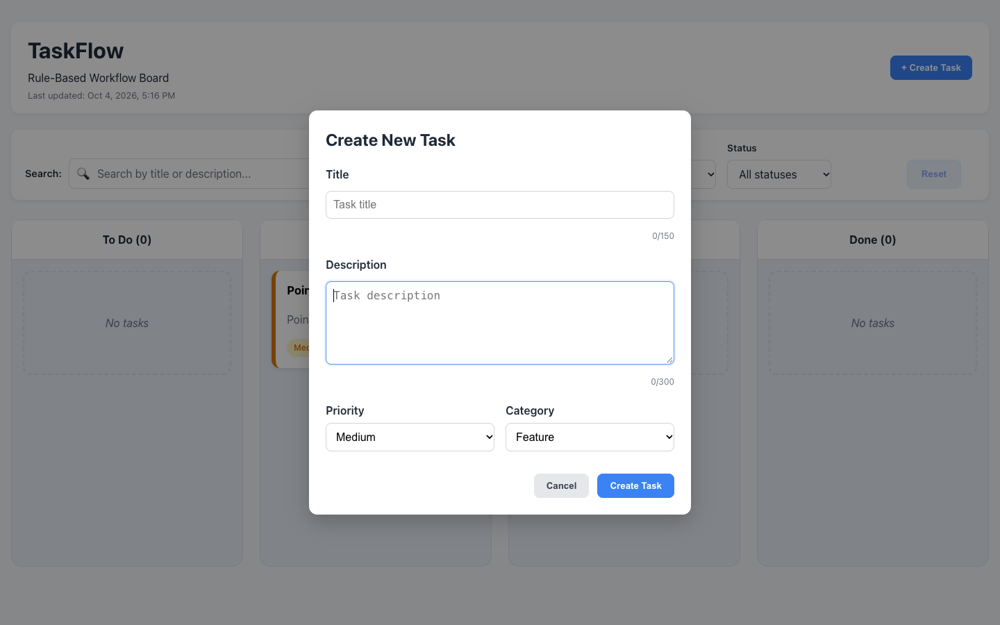
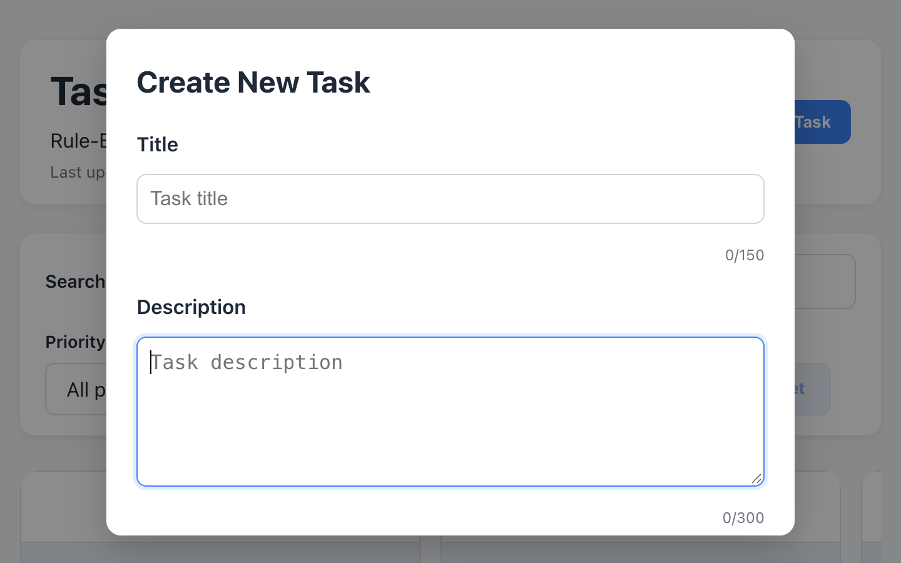

# Accessibility and keyboard interaction review

Scope: #68–#71, under #30. Branch: `fix/v1.5-accessibility-keyboard`.
Base: `develop` at `f572164`, including the merged component stylesheet refactor.

## Baseline and confirmed problems

The working tree was clean, `develop` matched `origin/develop`, and the component
styles, linked tasks, storage validation, and migrations were present before work.
The branch was published after the baseline passed.

| Check | Baseline | Final |
| --- | --- | --- |
| `npm test` | 221 tests / 11 files passed | 248 tests / 16 files passed |
| `npm run typecheck` | Passed | Passed |
| `npm run lint` | Passed | Passed |
| `npm run build` | Passed | Passed; 61 modules |
| `git diff --check` | Clean | Clean |

`npm install` completed without dependency or lockfile changes. It reported seven
existing high-severity advisories and the optional `fsevents` allow-scripts warning.
Final built assets: CSS 17.54 kB (3.95 kB gzip), JavaScript 277.72 kB
(86.35 kB gzip). Vitest also suggests reducing repeated jsdom environment creation;
the default test configuration was retained.

Before editing, source inspection and Chrome keyboard review confirmed:

- Task forms focused the title; confirmation dialogs focused Cancel; relationship
  dialogs focused the parent selector. Initial focus mostly worked.
- Tab escaped dialogs. Background controls remained available. Closing a dialog
  did not reliably restore the opener. Separate Escape listeners complicated
  nested dialogs and unsaved-change handling.
- Required fields, invalid state, errors, and character counts lacked complete
  programmatic associations. Repeated Edit/Delete controls lacked task context;
  the legacy checklist input depended on its placeholder.
- Keyboard dragging used the default incremental coordinates and generic
  instructions. Creation, deletion, and movement could leave focus on removed
  or hidden elements. Outcome announcements were incomplete.

## Implementation decisions

Task, relationship, and confirmation dialogs share `useModalFocus`. Only the
active dialog handles Escape and Tab. The hook contains forward/reverse focus,
preserves nested return targets, makes background content inert, and restores
focus after React commits. Newly inserted storage controls also become inert.
Escape follows the existing unsaved-change confirmation policy. No dialog
library or dependency was added.

Task fields have unique IDs, native required semantics, associated error/count
text, and invalid state. Failed submission focuses the first invalid control;
operation failures focus the form error summary. Counts are not live regions.
Task-specific accessible names distinguish repeated actions and parent/child
controls. Main, search, and named column regions provide navigation context.

The existing dnd-kit KeyboardSensor moves between measured workflow columns
using Left/Right. Space or Enter picks up and drops; Escape or Tab cancels.
Pointer and keyboard moves both validate the existing `MOVE_TASK` action through
the same domain rules and reducer. Automatic scrolling avoids dropping before
a smoothly scrolling destination is reached.

A persistent polite Board updates region announces pickup, destination,
successful actions, cancellation, and rejected movement. Repeated identical
messages replace the message node. Board toasts remain visible but do not make
duplicate announcements. Existing urgent storage failures retain their alert;
the persistent recovery text no longer announces it a second time. Notification
types and durations are unchanged.

Focus returns to the edited/moved task title, or Search when filtering hides it.
Nested child actions return to their parent dialog control. The first child's
creation replaces the standalone Add SubTask control; its stable ID allows focus
to return to the replacement inside the new section. Deletion selects the next
visible task in that column, then the previous task, then the column heading,
then Create Task. Filter controls retain focus; Reset Filters focuses Search.
Notification dismissal restores useful connected focus. Restoration uses React
lifecycle handling and a microtask, rather than arbitrary delays.

## Automated coverage

27 tests were added across five files:

- `ConfirmModal.test.tsx`: initial/name/description semantics, Tab and reverse Tab,
  Escape, trigger removal, StrictMode, background containment, and dynamically
  inserted background controls.
- `Board.accessibility.test.tsx`: field labels/errors/counts, repeated invalid
  submissions, create/edit/delete focus, nested child and relationship dialogs,
  unsaved-change confirmation, filtered movement, parent completion rejection,
  repeated announcements, reset, notification dismissal, and first-child focus.
- `Board.keyboard.test.tsx`: the real KeyboardSensor with measured geometry;
  valid movement, rejected movement, cancellation, focus, and announcements.
- `keyboardCoordinates.test.ts`: adjacent columns, boundaries, current drop
  destination, unsupported keys, and missing measurements.
- `App.accessibility.test.tsx`: existing invalid-storage recovery alert and
  confirmation focus semantics without changing the original saved bytes.

Existing test assertions were updated for descriptive accessible names and the
single polite outcome region. Domain, persistence, migrations, relationship,
sorting, and existing behavioral assertions remain in place.

## Browser verification

Chrome 154.0.8037.95 on macOS, production build served locally. Native keyboard
events through Chrome DevTools exercised the complete core workflow without
pointer input: 34 checks passed. A separate regression review passed nine checks
for real pointer dragging, persistence after refresh, viewport/focus visibility,
and a storage conflict inserting background controls while a dialog was open.

Chrome's accessibility tree exposed dialog names/descriptions, required and
invalid title state, task movement instructions, the main landmark, and named
columns. Background board controls were excluded during modal interaction.
No application runtime errors or new warnings were observed. Local requests to
the existing Vercel Speed Insights script return 404 outside Vercel; application,
JavaScript, and CSS resources loaded successfully.

Focus remained visible at 375, 768, and 1440 CSS pixels. A 720 × 450 CSS-pixel
viewport at device scale 2 checked the space equivalent to 200% zoom on a
1440 × 900 display. **This is viewport emulation, not actual browser zoom.**

## Preview review checklist

1. Tab to Create Task, open it, and traverse every field. Confirm Tab and
   Shift+Tab wrap inside the dialog. Submit empty/short values and identify the
   focused error field. Create and edit a valid task.
2. Add a child, edit it, manage its parent, and cancel each nested dialog. Confirm
   focus returns to the relevant parent control. Test Keep Editing and Discard
   Changes after modifying a form.
3. Tab to the task movement group before its title. Press Space/Enter, Right,
   then Space/Enter to move forward. Try a backward or skipped-stage move and
   completion of a parent with unfinished children. Confirm rejected moves leave
   the task unchanged. Test Escape and Tab cancellation.
4. Open deletion, cancel it, then delete a task. Check the next/previous task or
   column heading receives focus. Delete a parent and confirm its children remain.
5. Use Search and all filters; reset them. Move a task out of the selected status
   and confirm Search receives focus. Dismiss a toast and check useful focus.
6. Repeat with VoiceOver and Chrome: listen to dialog names, labels, required
   and invalid state, errors, movement instructions, success/rejection messages,
   repeated identical failures, and storage recovery. Confirm each outcome is
   announced once. **Actual screen-reader speech has not been tested here.**
7. Set actual browser zoom to 200% and repeat dialog traversal, scrolling, and
   movement. Verify focus remains visible. This check remains pending.

## Limits and deferred work

Accessibility-tree inspection does not certify VoiceOver, Safari, or NVDA speech.
No actual screen-reader/browser combination was tested. Owner screen-reader and
actual browser-zoom review remain required before considering verification done.
The Vercel Preview also requires owner review if deployment protection prevents
unauthenticated access.

This PR does not close #82: comprehensive typed notification/timing coverage
belongs to the notification package. Parent #30 remains open pending its broader
contrast, reduced-motion, and final assistive-technology review. Existing mobile
search spacing (#31) and legacy checklist completion styling (#40) are deferred.
No notification expansion, responsive redesign, persistence redesign, new board
features, or workflow-rule changes are included. Issue references remain
non-closing pending preview and assistive-technology acceptance review.
