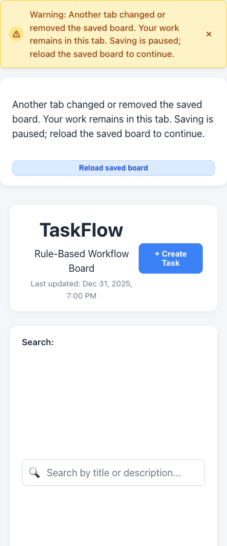
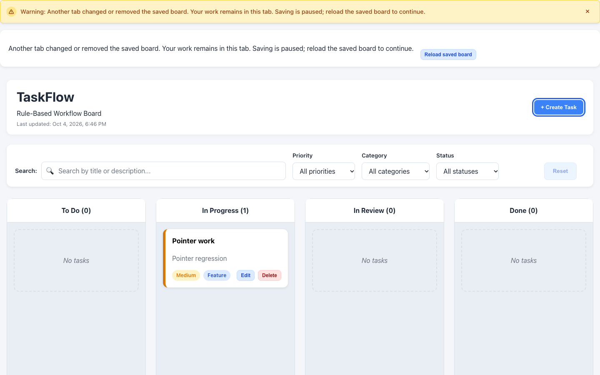

# Typed notification feedback

Scope: #72, #73, #74, #82, under #42. Branch:
`feature/v1.5-typed-notifications`; base `develop` at `f8c2b67` (merged PR #132).
#73 was already closed; this package integrates its existing feedback with the
typed model and completes the remaining notification coverage.

## Baseline and architecture audit

The tree was clean and `develop` fast-forwarded to the remote. Component styles,
linked tasks, persistence/migrations, multi-tab protection, modal focus handling,
field validation, and keyboard movement were all present.

The first baseline run passed 247 tests and timed out in the existing relationship
interaction test. Work stopped without edits or a new branch. After the user
requested a rerun, that test passed alone and the full baseline passed 248 tests
across 16 files. TypeScript, lint, production build, and diff checks passed.
`npm install` completed without dependency/lockfile changes and reported the
existing optional `fsevents` allow-scripts warning. The branch was published only
after the successful baseline.

The audit found two variants (success/error), two Board state variables and two
three-second timer paths. Replacement did clear the old timeout, but duplicated
logic made timing harder to maintain. Board messages expired automatically;
App persistence messages required dismissal and recovery controls stayed visible.
Migration feedback did not expire. Board's polite live region already prevented
duplicate toast announcements; App's recovery paragraph was intentionally nonlive.

Persistence already distinguished load/save outcomes and protected original bytes.
The UI grouped invalid data, migration failure, and valid external-tab changes
under errors. Migration text implied checklist conversion even when none existed.
Retry recovery did not give an explicit confirmed-save result. Relationship domain
errors were specific, but presentation treated every failure as an error.

## Model and timing policy

`src/notifications/notification.ts` defines a strict four-variant union and a
notification model with an ID, message, and discriminated dismissal behavior.
Automatic notifications require a duration; manual notifications have no duration.
The factory derives these combinations. A typed mapping supplies each variant's
label, icon, and announcement role. No timeout or notification is persisted in
the board, and the domain reducer remains unchanged.

| Variant | Real uses | Dismissal | Default announcement |
| --- | --- | --- | --- |
| Success | Task actions; confirmed saving after a failure | Automatic, 4 seconds | Polite |
| Information | Successful committed legacy migration | Automatic, 6 seconds | Polite |
| Warning | Blocked relationships/parent completion; invalid saved data fallback; valid external-tab conflict | Manual or resolved/replaced by an outcome in the same slot | Polite |
| Error | Workflow rejection; unavailable storage; failed writes/migration; future schema; unsafe external content | Manual or resolved/replaced by an outcome in the same slot | Assertive for storage; existing polite Board strategy for routine operations |

`useNotification` centralizes state, replacement, ID-based dismissal and timing.
Effects clear timers on replacement/dismissal/unmount. A stale callback can only
dismiss its own ID. External boundary snapshots use the same controller; an
unchanged dismissed snapshot is not replayed, and a new snapshot replaces it
before children render. The source is not copied by an effect that could reset
its interval. StrictMode, external replacement, equivalent messages and stale
callback behavior are tested.

App and Board have separate slots using this controller. A routine task success
cannot erase a storage warning. Dialogs use the controller for rejected domain
operations; ordinary field validation remains inline. This adds no global store,
third-party toast library, or notification queue.

## Persistence and parent/child behavior

- Invalid data opens an empty usable workspace, leaves the original untouched,
  and pauses saving. Its warning explicitly describes that partial fallback.
- Migration failure, future schema and unavailable storage have distinct error
  text. Exceptions and serialized user data are not displayed.
- Migration information is emitted only after successful migration **and write**.
  Failed writes retain retry recovery. A subsequent ordinary save does not replace
  or restart migration information; the next current-schema load is silent.
- Save failures preserve local work and never claim a confirmed save. A successful
  retry reports that changes are now saved. Routine successful saves are silent.
- Valid external changes are warnings; unsafe external content remains an error.
  Saving stays paused and local work is retained. Dismissing the banner leaves
  recovery controls available. The underlying reload/conflict policy is unchanged.
- There is no backup/import/in-app restore feature to announce. Existing explicit
  recovery confirms a full-page reload and revalidates saved data. Ordinary loads
  do not emit a synthetic restore-success notification.
- Existing domain error codes determine relationship warning severity. Rules and
  messages are not reimplemented in the notification component. Rejected moves,
  parent completion and relationship assignments leave the board unchanged.
- Parent deletion and unsaved changes still require their existing confirmations.
  A temporary warning does not replace them; deletion consequences are described
  in the confirmation and the resulting outcome is announced after confirmation.

## Accessibility and styling

Each variant has a visible text label and icon as well as its color. Notification
styles remain in `Notification.css`. Text contrast against the variant background
is 6.49:1 (success), 6.80:1 (error), 6.37:1 (warning), and 8.01:1 (information).
Long messages wrap, dismiss controls retain visible keyboard focus, and reduced
motion disables the notification entrance animation. Notifications remain in
document flow rather than covering controls.

Board outcomes retain the single polite Board updates live region. Equivalent
outcomes get fresh model IDs and replacement announcement nodes. Visible Board
toasts are nonlive. App storage banners announce once; persistent recovery text
is nonlive. Inline operation warnings are read through the refocused associated
parent selector or a named focused summary, without a second live toast.

Modal containment, Escape/unsaved policy, contextual field IDs and existing
post-action focus remain intact. Resolving a storage retry now focuses Create
Task when its Retry control is removed; this previously stranded focus on the
page body. Notification dismissal/expiry restores connected focus when needed.

## Automated verification

New coverage includes variant rendering/roles, type-level invalid combinations,
success/info expiry, manual warning/error dismissal, StrictMode cleanup, timer
replacement and stale callbacks, equivalent messages, external-source dismissal,
corruption/fallback, migration success/failure, future versions, unavailable
storage, failed write/retry, silent normal saves, persistent external-tab feedback,
real domain relationship error classification, and stale form/relationship
selections. Existing dialog and form tests retain initial focus, containment,
Escape, restoration, names/descriptions, labels, validation and confirmations.

Default unrestricted workers hit three existing accessibility test timeouts on a
busy machine; those files passed separately. Vitest now uses at most two workers
to bound jsdom contention, while preserving per-file isolation and the default
five-second timeout. No assertions were removed or relaxed.

| Final check | Result |
| --- | --- |
| `npm test` | 278 passed / 21 files; 30 added tests; 20.06 seconds |
| `npm run typecheck` | Passed |
| `npm run lint` | Passed |
| `npm run build` | Passed; 63 modules |
| `git diff --check` | Clean |

Final assets: CSS 17.91 kB (4.04 kB gzip), JavaScript 279.35 kB
(86.88 kB gzip). No dependencies or lockfile changed.

Chrome 154.0.8037.95 on macOS, local production build: 23 notification checks
passed using native keyboard events, controlled storage fixtures and a real second
browser tab. The earlier 34 keyboard workflow checks and nine pointer/layout
regression checks also passed again. HTML, JS and CSS returned 200. No application
runtime errors or new console warnings were found; the existing local Vercel
Speed Insights script returned 404 outside Vercel.

The review confirmed error persistence, keyboard dismissal, repeated announcement
node replacement, unchanged blocked parents, destructive confirmations, modal
containment, empty fallback accuracy, committed migration information and six-second
expiry, silent subsequent refresh, failed migration/future-schema errors, failed
writes without a saved-success claim, retry success/focus, actual multi-tab
warnings, 375-pixel notification bounds, disabled animation under reduced motion,
and accessible status/dismiss semantics. Invalid relationship selections are
normally excluded by the UI; integrated tests cover genuine stale-selection
rejections without manufacturing invalid options or extra buttons.




Screen-reader speech for the expanded variants was not tested. The prior package
received owner VoiceOver sign-off, but that does not certify these new feedback
flows. Signed-in hosted preview and VoiceOver review remain pending. Deployment
results and preview access limitations are recorded in the draft PR; issue
references are non-closing pending that acceptance review.

## Owner preview checklist

Use disposable data on the preview origin for persistence fixtures.

1. Attempt an invalid move. Confirm an Error message stays visible; dismiss it
   using Tab/Enter. Repeat the same move and listen for another single announcement.
2. Try completing a parent with unfinished children. Confirm a Warning includes
   task context and the parent stays put. Check parent deletion still confirms
   detachment; cancelling should not generate a second consequence notification.
3. Create/edit a task or child and confirm the Success notification expires after
   four seconds. Repeat dialog Tab/Shift+Tab/Escape and unsaved-change navigation.
4. On a disposable board, use DevTools Console to set invalid data:
   `localStorage.setItem('taskflow-board', '{broken'); location.reload();`
   Confirm the empty-workspace warning, preserved original bytes, paused saving,
   keyboard dismissal and persistent Reload controls.
5. Load a supported legacy fixture. Confirm Information appears after its upgrade,
   expires after six seconds, and does not repeat after refresh. A failed migration
   or unsupported future version should produce a persistent Error.
6. Simulate a write failure on disposable data. Local edits remain usable; no
   confirmed-save message appears. Restore writes and Retry saving: confirmed
   success appears and focus moves to Create Task.
7. Open the same preview in two tabs. Edit one; the other should show a persistent
   Warning and preserve local work. Routine edits in the paused tab must not
   remove the warning or overwrite the other tab's saved board.
8. Check a narrow viewport and OS/browser reduced-motion preference. Listen with
   VoiceOver to success, information, warning, error, repeated rejection and
   inline relationship warning feedback. Report silence or duplicate speech.

For step 5, this disposable version-1 fixture includes one unfinished checklist
item. Paste it into DevTools Console on the disposable preview origin:

```js
const fixtureDate = "2026-01-01T00:00:00.000Z";
const fixtureTask = {
  id: "migration-parent", title: "Migration parent", description: "Preview test",
  status: "todo", priority: "medium", category: "feature", createdAt: fixtureDate,
  subtasks: [{ id: "migration-child", title: "Migration child", completed: false }],
};
const fixtureBoard = {
  id: "migration-board", name: "Migration test", lastUpdated: fixtureDate,
  columns: ["todo", "in-progress", "in-review", "done"].map(id => ({
    id, title: id, tasks: id === "todo" ? [fixtureTask] : [],
  })),
};
localStorage.setItem("taskflow-board", JSON.stringify({ schemaVersion: 1, board: fixtureBoard }));
location.reload();
```

For step 6, temporarily block writes in the current disposable tab:

```js
window.taskflowTestOriginalWrite = Storage.prototype.setItem;
Storage.prototype.setItem = function () {
  throw new DOMException("Disposable test", "QuotaExceededError");
};
```

Edit a task and save. Then restore writes before selecting Retry saving:

```js
Storage.prototype.setItem = window.taskflowTestOriginalWrite;
delete window.taskflowTestOriginalWrite;
```

Refreshing also removes this temporary prototype override.

No capacity/WIP, due-date, import/export, search-empty, reset/clear-done, or
speculative v2 notification flows were added. Broader responsive work (#31),
legacy checklist styling (#40), and remaining parent accessibility work (#30)
remain outside this package. Actual screen-reader speech and signed-in Vercel
review must be reported separately from accessibility-tree inspection.
